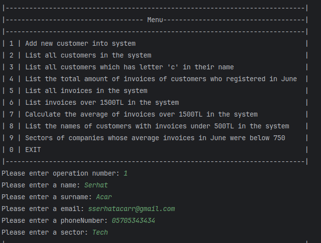
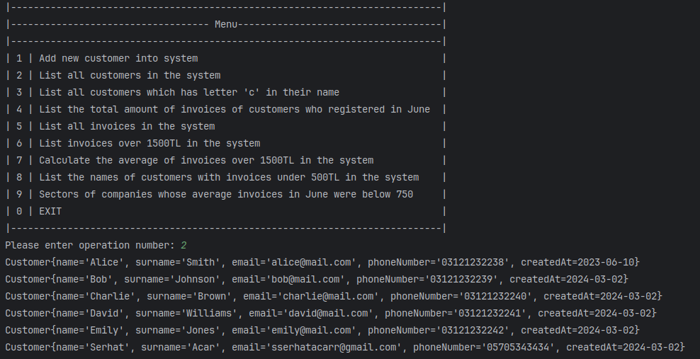
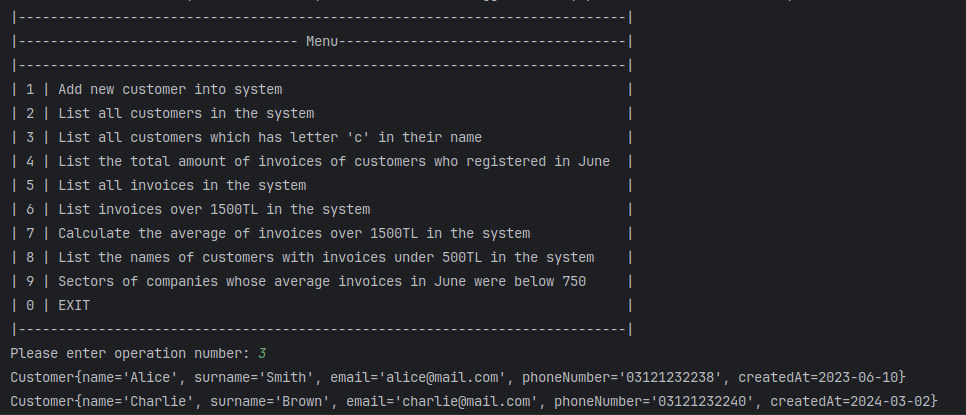
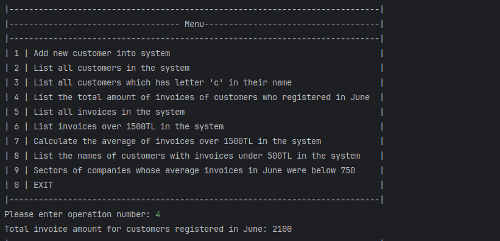
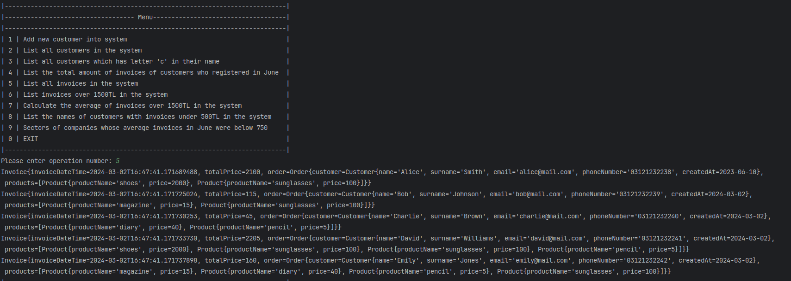
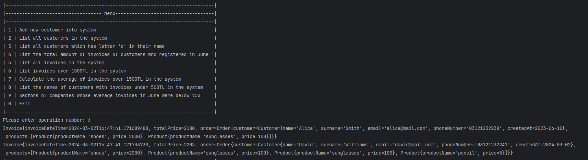
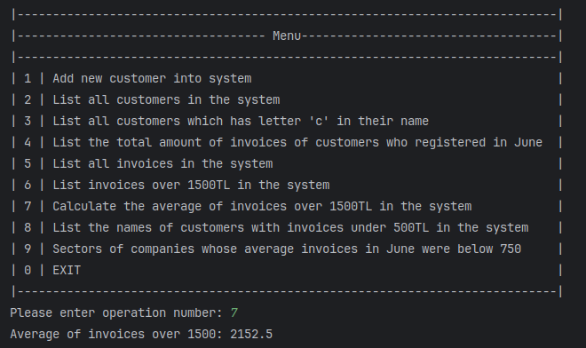
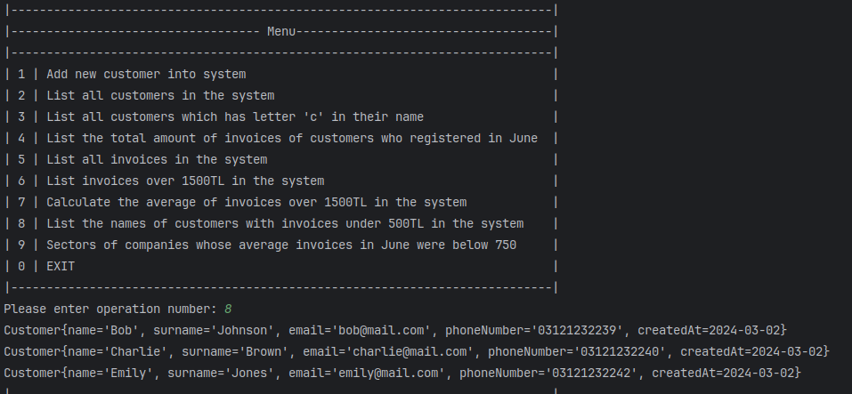

# Invoice Management System

This project provides a simple customer management system with features for adding, displaying, and searching customers, as well as handling bills and performing computations on them.

## Capabilities:

### Customer Management:
- Incorporate new customers into the system.
- Display all current customers.
- Search customers by names that include the letter "C".

### Invoice Management:
- Compute the total bill amount for customers registered in June.
- Display all bills in the system.
- Search bills by total amount exceeding 1500.
- Compute the mean of bills exceeding 1500.
- Display names of customers with bills below 500TL.
- Determine sectors of businesses whose average July bills were below 750TL.

## Instructions:

1. Clone or download the project repository.
2. Open the project in your chosen IDE.
3. Execute the MainRunner class to initiate the application and interact with the menu.

## Project Output Screenshots

## License

Distributed under the MIT License. See [`LICENSE`](LICENSE) for more details.

<!-- CONTACT -->

## Contact

### Serhat Acar

## Talenthub Bootcamp - N11 & Patika

  

<h3 align="center">Company: N11.com</h3>

  
<h3 align="center">Organizer: Patika.dev</h3>   

