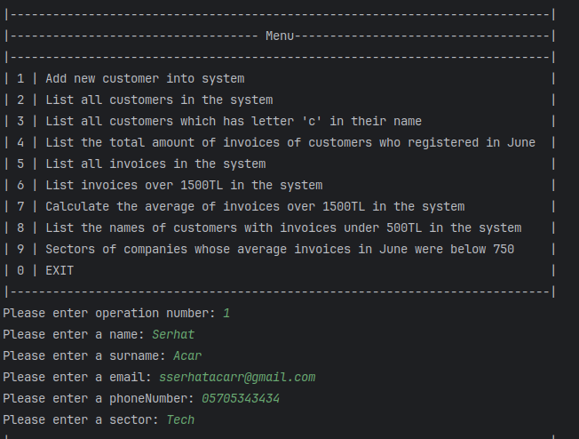
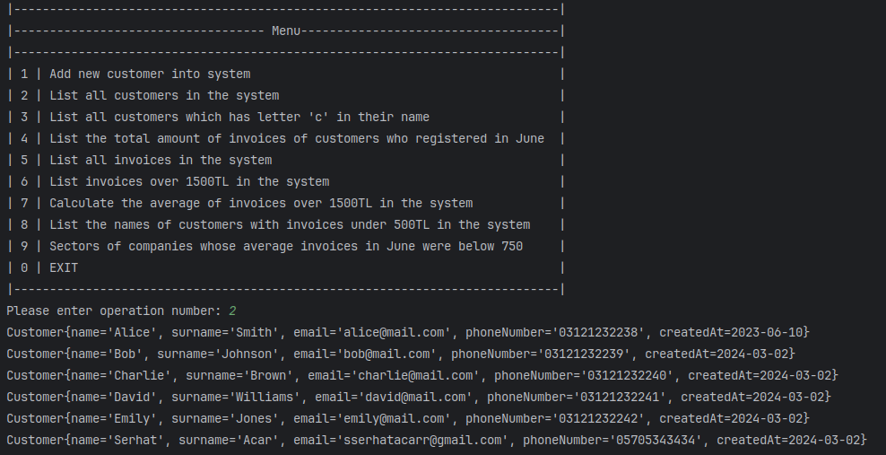
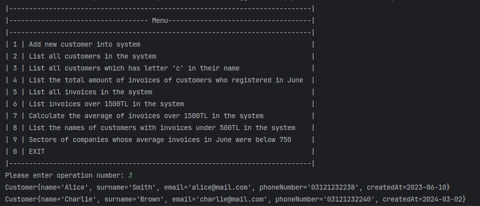
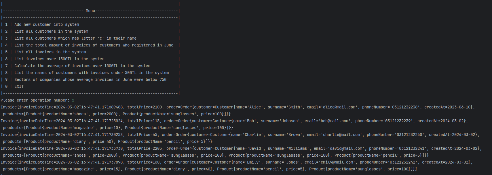
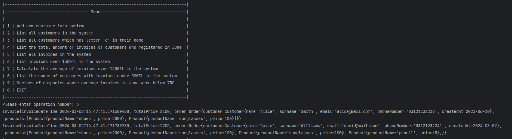
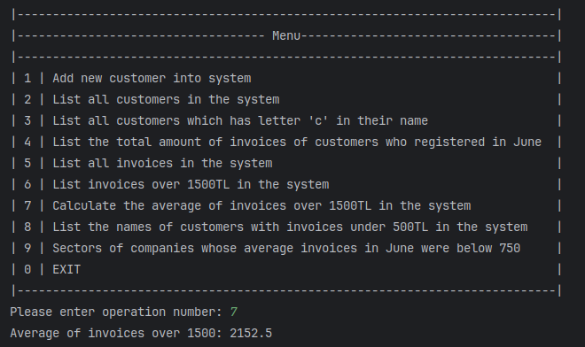
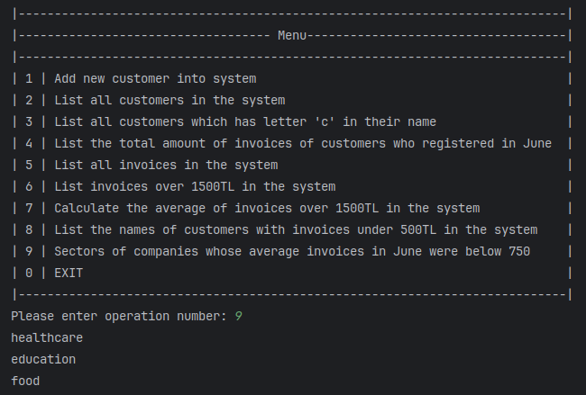

# Client Management System

This project provides a simple client management system with features for adding, displaying, and searching clients, as well as handling bills and performing computations on them.

## Capabilities:

### Client Management:
- Incorporate new clients into the system.
- Display all current clients.
- Search clients by names that include the letter "B".

### Bill Management:
- Compute the total bill amount for clients registered in July.
- Display all bills in the system.
- Search bills by total amount exceeding 2000TL.
- Compute the mean of bills exceeding 2000TL.
- Display names of clients with bills below 600TL.
- Determine sectors of businesses whose average July bills were below 800TL.

## Instructions:

1. Clone or download the project repository.
2. Open the project in your chosen IDE.
3. Execute the MainRunner class to initiate the application and interact with the menu.

## Project Output Screenshots

## License

Distributed under the MIT License. See [`LICENSE`](LICENSE) for more details.

<!-- CONTACT -->

## Contact

**John Doe**

